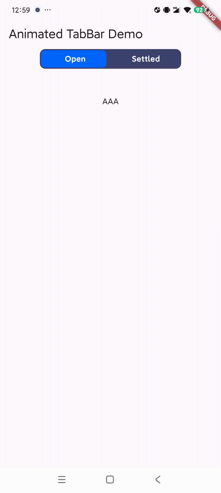

samples, guidance on mobile development, and a full API reference.

# Sliding Tabbar Example

This project demonstrates the implementation of a sliding tabbar in Flutter.

## Description

The sliding tabbar is a UI component that allows users to navigate between different views by
selecting tabs. In this project, the tabbar has two tabs: 'Open' and 'Settled'. The selected tab is
highlighted and the content of the view changes based on the selected tab.

## Project Structure

## Demo

## 示例

## 翻译

- [中文](README.zh.md)

The project consists of two main Dart files:

- `lib/main.dart`: This is the entry point of the Flutter application. It contains the main function
  and the `MyHomePage` widget which is the root of the widget tree.

- `lib/animated_tabbar.dart`: This file contains the `AnimatedTabBarWidget` which is a stateful
  widget. It maintains the state of the selected tab and updates the UI accordingly.

## How to Run

To run this project, follow these steps:

1. Clone the repository to your local machine.
2. Navigate to the project directory in your terminal.
3. Run `flutter pub get` to fetch the project dependencies.
4. Run `flutter run` to start the application.

## Requirements

- Flutter SDK
- Dart
- An IDE like Android Studio or VS Code

## Contributing

Pull requests are welcome. For major changes, please open an issue first to discuss what you would
like to change.

## License

[MIT](https://choosealicense.com/licenses/mit/)