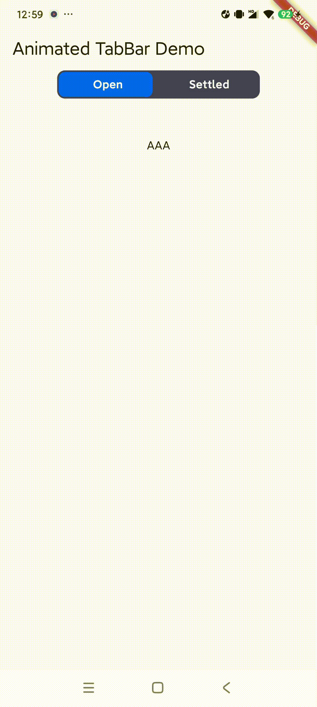

示例、移动开发指南和完整的API参考。

# 滑动Tabbar示例

此项目演示了在Flutter中实现滑动Tabbar的方法。

## 描述

滑动Tabbar是一个UI组件，允许用户通过选择标签来在不同的视图之间导航。在这个项目中，Tabbar有两个标签：'Open'和'Settled'。选中的标签会被高亮显示，视图的内容会根据选中的标签进行更改。

## 项目结构

## 演示

## 示例

## 翻译

- [中文](README.zh.md)

项目主要包括两个Dart文件：

- `lib/main.dart`：这是Flutter应用程序的入口点。它包含主函数和`MyHomePage`小部件，这是小部件树的根。

- `lib/animated_tabbar.dart`：此文件包含`AnimatedTabBarWidget`，这是一个有状态的小部件。它维护选中标签的状态，并相应地更新UI。

## 如何运行

要运行此项目，请按照以下步骤操作：

1. 将仓库克隆到本地机器。
2. 在终端中导航到项目目录。
3. 运行`flutter pub get`获取项目依赖项。
4. 运行`flutter run`启动应用程序。

## 要求

- Flutter SDK
- Dart
- 一个像Android Studio或VS Code的IDE

## 贡献

欢迎提出拉取请求。对于重大变更，请先开启一个问题进行讨论。

## 许可证

[MIT](https://choosealicense.com/licenses/mit/)